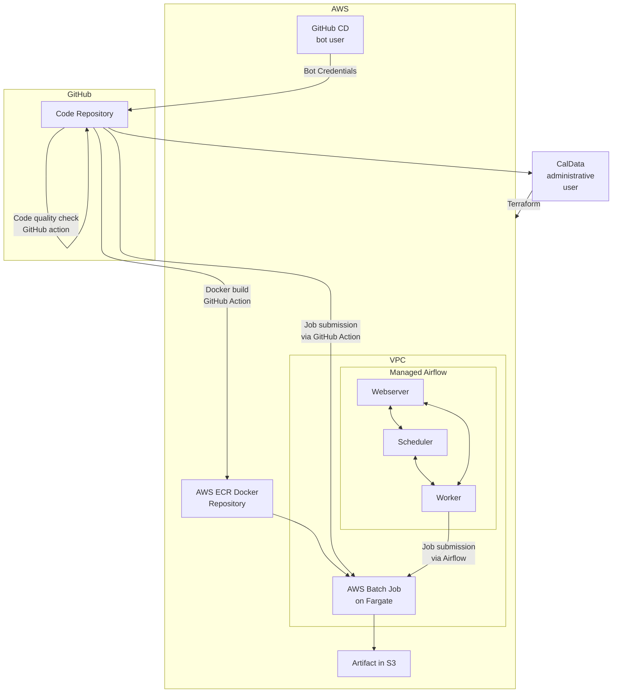

# Cloud Infrastructure

The DSE team uses Terraform to manage cloud infrastructure.
Our stack includes:

* An [AWS Batch](https://aws.amazon.com/batch/) environment for running arbitrary containerized jobs
* A [Managed Workflows on Apache Airflow](https://aws.amazon.com/managed-workflows-for-apache-airflow/) environment for orchestrating jobs
* A VPC and subnets for the above
* An ECR repository for hosting Docker images storing code and libraries for jobs
* A bot user for running AWS operations in GitHub Actions
* An S3 scratch bucket

## Architecture



## Setup

### Installation

This project requires Terraform to run.
You might use a different package manager to install it depending on your system.

For Macs, you can use `brew`:

```bash
brew install terraform
```

Anaconda users on any architecture should be able to use `conda` or `mamba`:

```bash
conda install -c conda-forge terraform
```

We also use `tflint` for linting, and `terraform-docs` to help with documentation of resources.
These can be installed in the same manner, e.g.:

```bash
conda install -c conda-forge tflint go-terraform-docs
```

There are a number of pre-commit checks that run on committing as well as in CI.
To install the checks, run the following from the repository root:

```bash
pre-commit install
```

You can manually run the pre-commit checks using:

```bash
pre-commit run --all-files
```

### Bootstrapping remote state

When deploying a new version of your infrastrucutre, Terraform diffs the current state
against what you have specified in your infrastructure-as-code.
The current state is tracked in a JSON document,
which can be stored in any of a number of locations (including local files).

This project stores remote state using the [S3 backend](https://developer.hashicorp.com/terraform/language/settings/backends/s3).

Different applications or environments can be isolated from each other by using
different S3 buckets for holding their state.
We reuse a terraform configuration (`terraform/s3-remote-state`) for setting up the S3 backend

!!! note
    The S3 remote state configuration is not a proper module because it contains
    a provider block. Different deployments of the configuration are controlled
    by giving it different `tfvars` files, and capturing the outputs for use in
    a `tfbackend` file.

Here is an example set of commands for bootstrapping a new S3 backend for a deployment.
Suppose the deployment is a QA environment of our Snowflake project:

```bash
cd terraform/snowflake/environments/qa  # Go to the new environment directory
mkdir remote-state  # Create a remote-state directory
cd remote-state
ln -s ../../../s3-remote-state/main.tf main.tf  # symlink the s3 configuration
terraform init  # initialize the remote state backend
terraform apply -var="owner=dse" -var="environment=qa" -var="project=snowflake"  # Create the infrastructure
terraform output > ../dse-snowflake-qa.tfbackend  # Pipe the outputs to a .tfbackend

cd ..
terraform init -backend-config=./dse-snowflake-qa.tfbackend  # Configure the deployment with the new backend.
```

## Deploying Infrastructure

When you are ready to deploy a new version of the infrastructure, run

```bash
terraform apply
```

This will output the changes to the infrastructure that will be made, and prompt you for confirmation.


<!-- BEGIN_TF_DOCS -->
## Requirements

| Name | Version |
|------|---------|
| <a name="requirement_terraform"></a> [terraform](#requirement\_terraform) | >= 1.0 |
| <a name="requirement_aws"></a> [aws](#requirement\_aws) | 4.56.0 |
| <a name="requirement_random"></a> [random](#requirement\_random) | 3.4.3 |

## Providers

| Name | Version |
|------|---------|
| <a name="provider_aws"></a> [aws](#provider\_aws) | 4.56.0 |
| <a name="provider_random"></a> [random](#provider\_random) | 3.4.3 |

## Modules

No modules.

## Resources

| Name | Type |
|------|------|
| [aws_batch_compute_environment.default](https://registry.terraform.io/providers/hashicorp/aws/4.56.0/docs/resources/batch_compute_environment) | resource |
| [aws_batch_job_definition.default](https://registry.terraform.io/providers/hashicorp/aws/4.56.0/docs/resources/batch_job_definition) | resource |
| [aws_batch_job_queue.default](https://registry.terraform.io/providers/hashicorp/aws/4.56.0/docs/resources/batch_job_queue) | resource |
| [aws_ecr_repository.default](https://registry.terraform.io/providers/hashicorp/aws/4.56.0/docs/resources/ecr_repository) | resource |
| [aws_eip.this](https://registry.terraform.io/providers/hashicorp/aws/4.56.0/docs/resources/eip) | resource |
| [aws_iam_group.aae](https://registry.terraform.io/providers/hashicorp/aws/4.56.0/docs/resources/iam_group) | resource |
| [aws_iam_group_membership.aae](https://registry.terraform.io/providers/hashicorp/aws/4.56.0/docs/resources/iam_group_membership) | resource |
| [aws_iam_group_policy_attachment.aae_dsa_project](https://registry.terraform.io/providers/hashicorp/aws/4.56.0/docs/resources/iam_group_policy_attachment) | resource |
| [aws_iam_group_policy_attachment.aae_list_all_my_buckets](https://registry.terraform.io/providers/hashicorp/aws/4.56.0/docs/resources/iam_group_policy_attachment) | resource |
| [aws_iam_group_policy_attachment.aae_self_manage_creentials](https://registry.terraform.io/providers/hashicorp/aws/4.56.0/docs/resources/iam_group_policy_attachment) | resource |
| [aws_iam_policy.access_secrets](https://registry.terraform.io/providers/hashicorp/aws/4.56.0/docs/resources/iam_policy) | resource |
| [aws_iam_policy.batch_submit_policy](https://registry.terraform.io/providers/hashicorp/aws/4.56.0/docs/resources/iam_policy) | resource |
| [aws_iam_policy.default_ecr_policy](https://registry.terraform.io/providers/hashicorp/aws/4.56.0/docs/resources/iam_policy) | resource |
| [aws_iam_policy.mwaa](https://registry.terraform.io/providers/hashicorp/aws/4.56.0/docs/resources/iam_policy) | resource |
| [aws_iam_policy.s3_dsa_project_policy](https://registry.terraform.io/providers/hashicorp/aws/4.56.0/docs/resources/iam_policy) | resource |
| [aws_iam_policy.s3_list_all_my_buckets](https://registry.terraform.io/providers/hashicorp/aws/4.56.0/docs/resources/iam_policy) | resource |
| [aws_iam_policy.s3_scratch_policy](https://registry.terraform.io/providers/hashicorp/aws/4.56.0/docs/resources/iam_policy) | resource |
| [aws_iam_policy.self_manage_credentials](https://registry.terraform.io/providers/hashicorp/aws/4.56.0/docs/resources/iam_policy) | resource |
| [aws_iam_role.aws_batch_service_role](https://registry.terraform.io/providers/hashicorp/aws/4.56.0/docs/resources/iam_role) | resource |
| [aws_iam_role.batch_job_role](https://registry.terraform.io/providers/hashicorp/aws/4.56.0/docs/resources/iam_role) | resource |
| [aws_iam_role.ecs_task_execution_role](https://registry.terraform.io/providers/hashicorp/aws/4.56.0/docs/resources/iam_role) | resource |
| [aws_iam_role.mwaa](https://registry.terraform.io/providers/hashicorp/aws/4.56.0/docs/resources/iam_role) | resource |
| [aws_iam_role_policy_attachment.aws_batch_service_role](https://registry.terraform.io/providers/hashicorp/aws/4.56.0/docs/resources/iam_role_policy_attachment) | resource |
| [aws_iam_role_policy_attachment.ecs_task_execution_access_secrets](https://registry.terraform.io/providers/hashicorp/aws/4.56.0/docs/resources/iam_role_policy_attachment) | resource |
| [aws_iam_role_policy_attachment.ecs_task_execution_role_policy](https://registry.terraform.io/providers/hashicorp/aws/4.56.0/docs/resources/iam_role_policy_attachment) | resource |
| [aws_iam_role_policy_attachment.mwaa_batch_submit_role](https://registry.terraform.io/providers/hashicorp/aws/4.56.0/docs/resources/iam_role_policy_attachment) | resource |
| [aws_iam_role_policy_attachment.mwaa_execution_role](https://registry.terraform.io/providers/hashicorp/aws/4.56.0/docs/resources/iam_role_policy_attachment) | resource |
| [aws_iam_role_policy_attachment.s3_scratch_policy_role_attachment](https://registry.terraform.io/providers/hashicorp/aws/4.56.0/docs/resources/iam_role_policy_attachment) | resource |
| [aws_iam_user.arman](https://registry.terraform.io/providers/hashicorp/aws/4.56.0/docs/resources/iam_user) | resource |
| [aws_iam_user.cd_bot](https://registry.terraform.io/providers/hashicorp/aws/4.56.0/docs/resources/iam_user) | resource |
| [aws_iam_user.esa](https://registry.terraform.io/providers/hashicorp/aws/4.56.0/docs/resources/iam_user) | resource |
| [aws_iam_user.kim](https://registry.terraform.io/providers/hashicorp/aws/4.56.0/docs/resources/iam_user) | resource |
| [aws_iam_user.monica](https://registry.terraform.io/providers/hashicorp/aws/4.56.0/docs/resources/iam_user) | resource |
| [aws_iam_user.rocio](https://registry.terraform.io/providers/hashicorp/aws/4.56.0/docs/resources/iam_user) | resource |
| [aws_iam_user_policy_attachment.batch_cd_bot_policy_attachment](https://registry.terraform.io/providers/hashicorp/aws/4.56.0/docs/resources/iam_user_policy_attachment) | resource |
| [aws_iam_user_policy_attachment.ecr_cd_bot_policy_attachment](https://registry.terraform.io/providers/hashicorp/aws/4.56.0/docs/resources/iam_user_policy_attachment) | resource |
| [aws_internet_gateway.this](https://registry.terraform.io/providers/hashicorp/aws/4.56.0/docs/resources/internet_gateway) | resource |
| [aws_mwaa_environment.this](https://registry.terraform.io/providers/hashicorp/aws/4.56.0/docs/resources/mwaa_environment) | resource |
| [aws_nat_gateway.this](https://registry.terraform.io/providers/hashicorp/aws/4.56.0/docs/resources/nat_gateway) | resource |
| [aws_route_table.private](https://registry.terraform.io/providers/hashicorp/aws/4.56.0/docs/resources/route_table) | resource |
| [aws_route_table.public](https://registry.terraform.io/providers/hashicorp/aws/4.56.0/docs/resources/route_table) | resource |
| [aws_route_table_association.private](https://registry.terraform.io/providers/hashicorp/aws/4.56.0/docs/resources/route_table_association) | resource |
| [aws_route_table_association.public](https://registry.terraform.io/providers/hashicorp/aws/4.56.0/docs/resources/route_table_association) | resource |
| [aws_s3_bucket.dsa_project](https://registry.terraform.io/providers/hashicorp/aws/4.56.0/docs/resources/s3_bucket) | resource |
| [aws_s3_bucket.mwaa](https://registry.terraform.io/providers/hashicorp/aws/4.56.0/docs/resources/s3_bucket) | resource |
| [aws_s3_bucket.scratch](https://registry.terraform.io/providers/hashicorp/aws/4.56.0/docs/resources/s3_bucket) | resource |
| [aws_s3_bucket_public_access_block.mwaa](https://registry.terraform.io/providers/hashicorp/aws/4.56.0/docs/resources/s3_bucket_public_access_block) | resource |
| [aws_s3_bucket_versioning.dsa_project](https://registry.terraform.io/providers/hashicorp/aws/4.56.0/docs/resources/s3_bucket_versioning) | resource |
| [aws_s3_bucket_versioning.mwaa](https://registry.terraform.io/providers/hashicorp/aws/4.56.0/docs/resources/s3_bucket_versioning) | resource |
| [aws_security_group.batch](https://registry.terraform.io/providers/hashicorp/aws/4.56.0/docs/resources/security_group) | resource |
| [aws_security_group.mwaa](https://registry.terraform.io/providers/hashicorp/aws/4.56.0/docs/resources/security_group) | resource |
| [aws_subnet.private](https://registry.terraform.io/providers/hashicorp/aws/4.56.0/docs/resources/subnet) | resource |
| [aws_subnet.public](https://registry.terraform.io/providers/hashicorp/aws/4.56.0/docs/resources/subnet) | resource |
| [aws_vpc.this](https://registry.terraform.io/providers/hashicorp/aws/4.56.0/docs/resources/vpc) | resource |
| [random_id.private_subnet](https://registry.terraform.io/providers/hashicorp/random/3.4.3/docs/resources/id) | resource |
| [random_id.public_subnet](https://registry.terraform.io/providers/hashicorp/random/3.4.3/docs/resources/id) | resource |
| [aws_availability_zones.available](https://registry.terraform.io/providers/hashicorp/aws/4.56.0/docs/data-sources/availability_zones) | data source |
| [aws_caller_identity.current](https://registry.terraform.io/providers/hashicorp/aws/4.56.0/docs/data-sources/caller_identity) | data source |
| [aws_iam_policy_document.access_secrets](https://registry.terraform.io/providers/hashicorp/aws/4.56.0/docs/data-sources/iam_policy_document) | data source |
| [aws_iam_policy_document.assume](https://registry.terraform.io/providers/hashicorp/aws/4.56.0/docs/data-sources/iam_policy_document) | data source |
| [aws_iam_policy_document.assume_role_policy](https://registry.terraform.io/providers/hashicorp/aws/4.56.0/docs/data-sources/iam_policy_document) | data source |
| [aws_iam_policy_document.aws_batch_service_policy](https://registry.terraform.io/providers/hashicorp/aws/4.56.0/docs/data-sources/iam_policy_document) | data source |
| [aws_iam_policy_document.batch_submit_policy_document](https://registry.terraform.io/providers/hashicorp/aws/4.56.0/docs/data-sources/iam_policy_document) | data source |
| [aws_iam_policy_document.default_ecr_policy_document](https://registry.terraform.io/providers/hashicorp/aws/4.56.0/docs/data-sources/iam_policy_document) | data source |
| [aws_iam_policy_document.mwaa](https://registry.terraform.io/providers/hashicorp/aws/4.56.0/docs/data-sources/iam_policy_document) | data source |
| [aws_iam_policy_document.s3_dsa_project_policy_document](https://registry.terraform.io/providers/hashicorp/aws/4.56.0/docs/data-sources/iam_policy_document) | data source |
| [aws_iam_policy_document.s3_list_all_my_buckets](https://registry.terraform.io/providers/hashicorp/aws/4.56.0/docs/data-sources/iam_policy_document) | data source |
| [aws_iam_policy_document.s3_scratch_policy_document](https://registry.terraform.io/providers/hashicorp/aws/4.56.0/docs/data-sources/iam_policy_document) | data source |
| [aws_iam_policy_document.self_manage_credentials](https://registry.terraform.io/providers/hashicorp/aws/4.56.0/docs/data-sources/iam_policy_document) | data source |

## Inputs

| Name | Description | Type | Default | Required |
|------|-------------|------|---------|:--------:|
| <a name="input_environment"></a> [environment](#input\_environment) | Deployment environment of the resource | `string` | `"dev"` | no |
| <a name="input_owner"></a> [owner](#input\_owner) | Owner of the resource | `string` | `"dse"` | no |
| <a name="input_project"></a> [project](#input\_project) | Name of the project the resource is serving | `string` | `"infra"` | no |
| <a name="input_region"></a> [region](#input\_region) | Region for AWS resources | `string` | `"us-west-2"` | no |

## Outputs

| Name | Description |
|------|-------------|
| <a name="output_state"></a> [state](#output\_state) | Resources from terraform-state |
<!-- END_TF_DOCS -->
