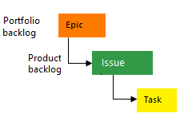
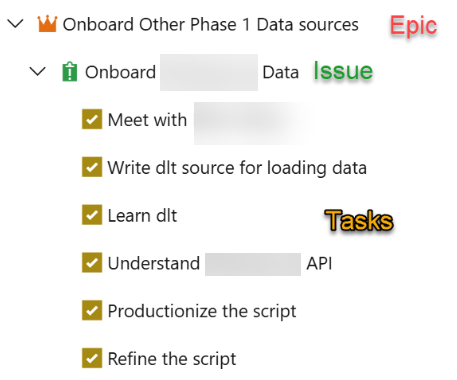
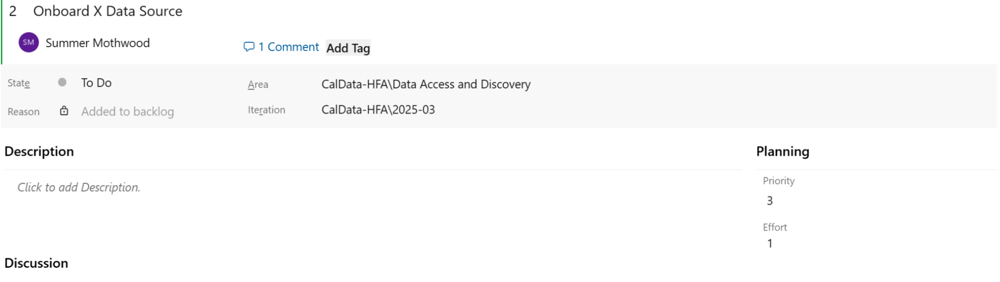

# Azure DevOps and Project Management

While GitHub is the primary tool used by the Data Operations team for code development and task tracking, we sometimes use Azure DevOps instead for clients that are already established in the Azure environment. This page covers practices and guidelines to be followed when using DevOps from a project management perspective to ensure work items contain sufficient detail so we know what needs to be done, how much effort is involved, and how to prioritize it against other issues.

## Work Item Types

1. Epics are used to group work under larger categories, for example "Phase 1 Data Source Modeling".
    1. All work should roll up to an Epic. These can be broad categories like "Phase 1 Data Modeling", for example.
2. Issues and tasks are used to track work.
    1. Issues will be our primary work item type.
    2. Tasks to break the work out further as needed. These are the detailed steps needed to complete the issue. Tasks can also be used to assign work that is split between multiple people, since DevOps only allows for one assignee on a work item.

## Work Item Guidelines

1. Title: This can be short, but should give enough detail to identify what work this issue is related to and differentiate it from similar task. For example, “Review Documentation for [Specific Data Source Name]”, as opposed to “Review Documentation” which is too vague.
2. Description: This should be detailed enough that anyone viewing the issue knows what work needs to be done, and what the ideal outcome or deliverable is once this work is complete (success criteria).
3. The following items should always be filled in when creating a new issue. If you are unsure what to enter, reach out to the Project Manager to discuss, or bring it up in daily standup or weekly sprint planning meetings to discuss with the team.
    1. Assignee: If you are unsure who to assign the item to, leave it blank for now. Then add a comment that you think it may need to be assigned to someone else and we can discuss in the next team meeting. Note that unliked GitHub, Azure DevOps only allows assigning a work item to a single person. To assign something to multiple people it must be broken out into multiple work items.
    2. Priority: Indicates how soon the work needs to start. See definitions in the appendix at the end of this document.
    3. Effort: Effort indicates how much time the work will take to complete once it has started. See definitions in the appendix at the end of this document. Tasks should ideally be sized appropriately so that they can be completed in <1 sprint of work. So Tiny (1 hour), Small (1 day), and Medium (1 week) are appropriate sizes for tasks. A Large (2+ weeks) or X-Large (months) task should be broken up into smaller work items for easier tracking from sprint to sprint. 
    4. Iteration (aka Sprint): We track work in two-week sprint cycles. Sprint names follow the a convention of [current year]-[sequential sprint number]. So the first sprint of the year 2025 is "2025-01". The last sprint of the year 2025 is "2025-26". 
        1. If work on an issue or task will start within the next 2 sprints, assign it to the appropriate sprint during Sprint Planning meetings. Work planned further than 2 sprints out does not need to be assigned to a sprint and can be left in the backlog, unless there is a known due date or we want to make sure something starts at a certain date.
    5. Area: This is a high level category at a broader level than Epic. Examples are Data Modeling, Training, Data Onboarding, etc. This is used for tracking purposes only. The Project Manager can help assign to the correct Area if needed.
    7. Status: Assign a status on the current state of the issue. See below for status options. Make sure to fully close a work item when completed by setting the status to Done.

## Effort Definitions

Note: Effort is a numeric open text box in Azure DevOps, rather than a drop-down with predetermined options like in GitHub. Below we list the numeric value to enter for the different Effort levels, in order to standardize across our projects. The sizes we use are roughly equivalent to the number of days we think the work will take to complete. We use 0.125 for Tiny as it aligns with one hour in a 8-hour work day.

**Tiny = 0.125**

- Easy task, something that can be completed in about an hour. It may not require issue creation but could use as a reminder to complete the task later in the sprint (if something takes less than 30 minutes, no need for an issue).
- Example: Sending a follow-up email

**Small = 1**

- A task that can be completed in one day
- Example: Reviewing documentation on an API to determine how to onboard a new data source.

**Medium = 5**

- A task that can be completed in about a week
- More complex but still straightforward to complete
- Example: Creating a staging or intermediate data model for a source that is well-understood and does not require complex logic.

**Large = 10**

- A task that can be completed in 2 or more weeks
- Increased complexity, may require slower manual work or unknowns that require research and discovery
- Example: Writing an API script for a new, unknown data source.

**X-Large = 20**

- Tasks that may take a month or longer to complete
- Consider breaking up into smaller work items if possible
- Example: Building a full set of end-to-end models for a new data source, including staging, intermediate, and mart models.

## Priority Definitions

Note: Priority in Azure DevOps is a dropdown with options from 1-4. We use the following definitions for those numbers to standardize across our projects.

**Urgent = 1**

- Top priority, usually reserved for unexpected emergency item.
- Putting everything else on backburner, aiming for completion ASAP
- Not assigned as part of regular sprint planning process

**High = 2**

- Goal is to complete this sprint

**Medium = 3**

- Less important than High, aim to complete within 2-4 sprints
- OK to push to next sprint if needed

**Low = 4**

- Work on as time allows, may leave in backlog

## Status Definitions

1. **To Do**: This is the default status when a work item is created, indicates no work has started yet.
2. **Doing**: Choose this status once work has started on the issue.
3. **Done**: Indicates the work item is completed. If the work item is linked to a Pull Request, you will be given an option to close it when merging the PR. Or you can choose this status when viewing the work item. 
