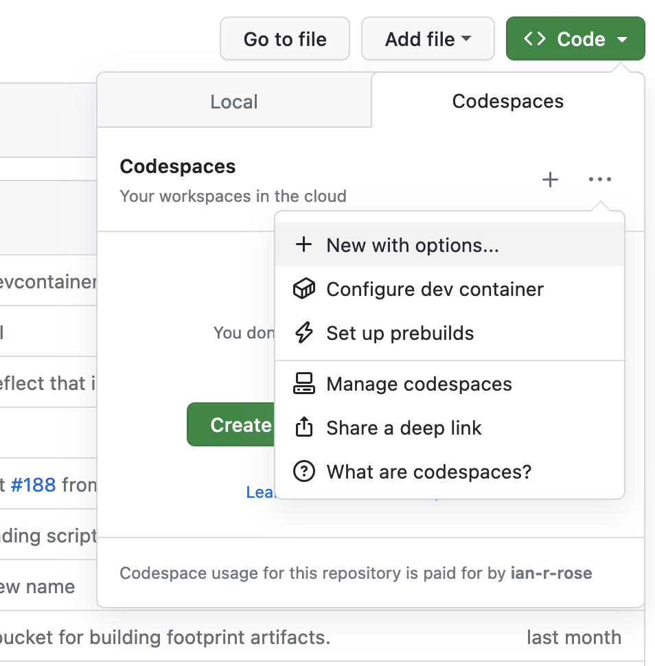
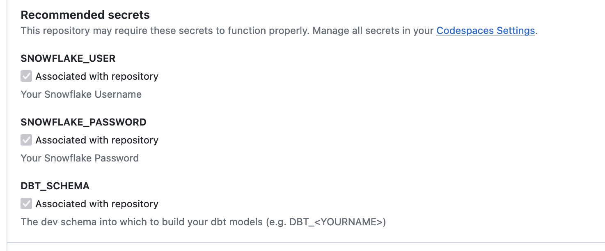
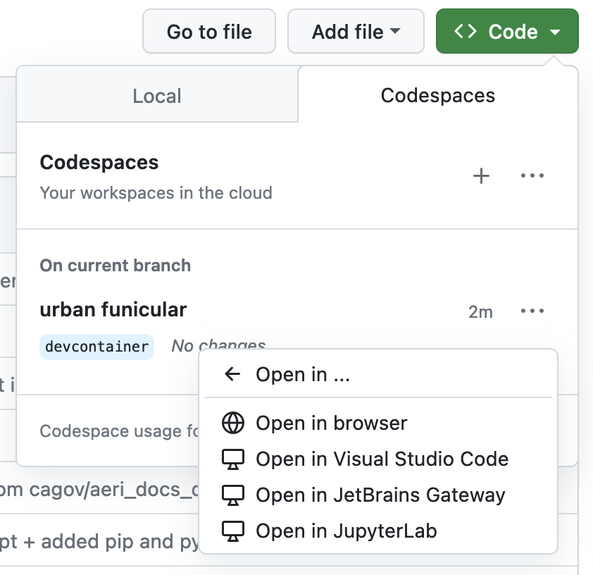

# Developing using Codespaces

GitHub Codespaces allow you to spin up an ephemeral development environment in VS Code
which includes a git repository, configurations, and pre-installed libraries.
It provides an easy way for developers to get started working in a repository,
especially if they are uncomfortable

## Creating a Codespace

Go to the "Code" dropdown from the main repository page,
select the three dot dropdown, and select "New with options..."
This will allow more configuration than the default codespace.



In the codespace configuration form, you will have an option to add "Recommended Secrets".
This is where you can add your personal Snowflake credentials to your codespace,
allowing for development against our Snowflake warehouse, including using dbt.
You should only add credentials for accounts that are protected by multi-factor authentication (MFA).



After you have added your secrets, click "Create Codespace".
Building it may take a few minutes,
but then you should be redirected to a VS Code environment in your browser.

## Launching an existing Codespace

Once your codespace is created, you should be able to launch it
without re-creating it every time using the "Code" dropdown,
going to "Open in...", and selecting "Open in browser":



## Using a Codespace

Once you have created and configured a codespace,
you have access to a relatively full-featured VS Code-based development environment.
This includes:

* An integrated bash terminal
* dbt profiles configured
* All Python dependencies for the project
* All pre-commit hooks installed
* git configured using your GitHub account

### Usage notes

1. When you launch a new codespace, it can take a couple of minutes for all of the extensions to install. In particular, this means that the Python environment may not be fully set-up when you land in VS Code. We recommend closing existing terminal sessions and starting a new one once the extensions have finished installig.
1. The first time you make a commit, the pre-commit hooks will be installed. This may take a few minutes. Subsequent commits will take less time.
1. If the pre-commit hooks fail when making a commit, it will give you the opportunity to open the git logs to view the errors. If you are unable to fix the errors for whatever reason, you can always make a new commit from the command line with `--no-verify`:
    ```bash
    git commit --no-verify -m "Your commit message"
    ```
