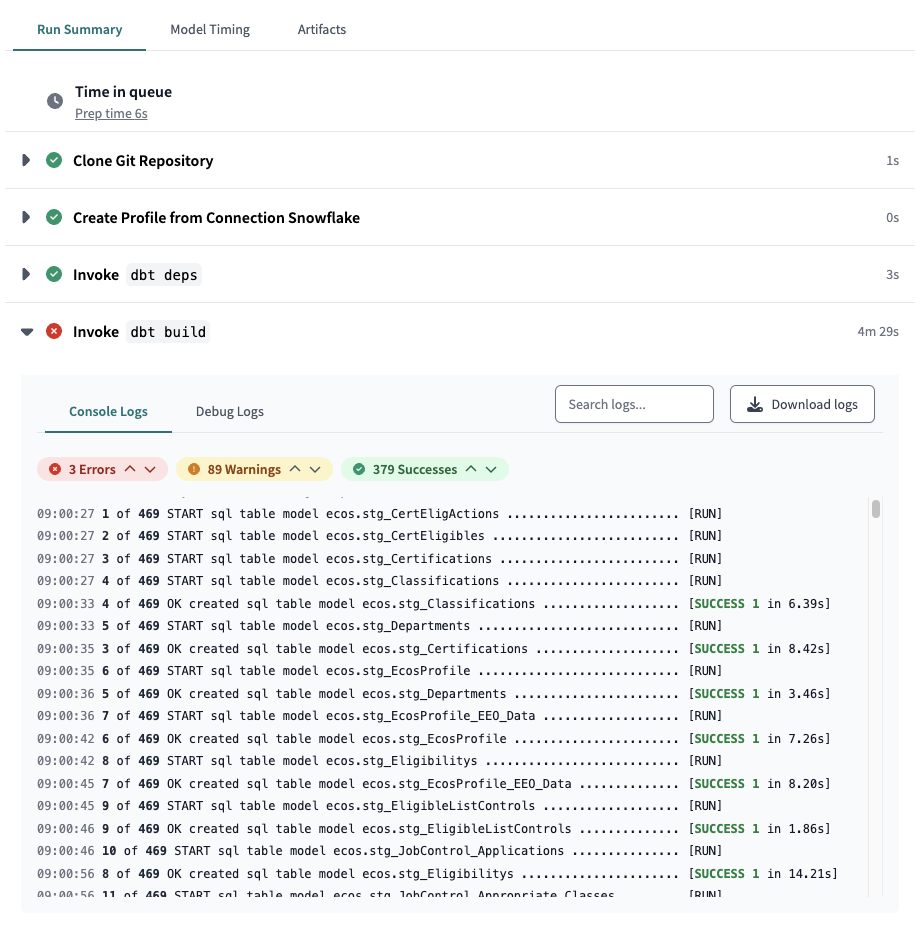
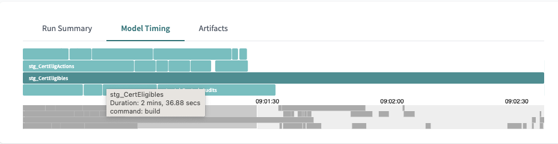

# dbt Performance Evaluation and Tuning


## Considerations: When Does Performance Matter?
In most settings, what is considered acceptable performance is relative to business needs and constraints. It's not atypical to deem the performance acceptable as long as there are no scheduling conflicts and models can run within a timeframe dictated by the frequency of the models running. In other words, if you need to run models every hour then the entire job cannot take longer than an hour to run. In general compute costs are not so high to necessarily be worth optimizing the underlying queries but may be high enough to optimize frequency or data size.

### Costs
Although compute time is relatively cheap, it's sometimes possible with larger datasets that need to be frequently refreshed to optimize performance to save enough costs to be worth the time to optimize. In Snowflake you can easily monitor costs in the Admin/Usage section of the Snowflake UI, where you can see credits used by warehouse and role.
Snowflake also provides several tables with meta information that can be used to derive exact costs for each query - an approach to this, with a ready-use-query can be found in the Select.dev blog post ["Calculating cost per query in Snowflake"](https://select.dev/posts/cost-per-query)

Typically, unless model performance is obviously very poor you are better off adjusting the frequency of runs (end users almost always over-state their desire for data freshness) or reducing data set size either by limiting what you provide or by using [incremental models](#2-materialization-matters).

In other words, very often the questions you should be asking are not in the category of SQL performance tuning but rather "do we need this data to be this fresh?" and "do we need all this data?".

### Scheduling Conflicts:
Often performance issues show up in scheduling. If you are running jobs once a day it is extremely unlikely you will run into any scheduling conflicts. However, if a much higher frequency is required, it's possible for jobs to take longer than that time between runs. In this case a common first approach is to break up model runs so that things that don't need to run as frequently can run separately from models that require more frequent updating. A typical way of doing this is to either use dbt run --select or dbt tags [dbt tags ](https://docs.getdbt.com/reference/resource-configs/tags) to select models in groups.
This is not to say performance tuning of individual queries is never worth it but that the big macro gains come more from running models less frequently and/or with less data, e.g. using filtering or [incremental models](#2-materialization-matters).

### The Tradeoffs
It is extremely important to balance time spent in optimizing model performance with compute costs and other concerns. If it takes you a day to optimize a model to run only a few seconds faster and save a few pennies per run, it's not likely worth the effort. Similarly, the use of incremental materilization can certainly reduce build time but introduce complexity and require a degree of monitoring to ensure integrity. See also [Materialization Matters](#2-materialization-matters) below.

## Analyzing Performance in dbt
With every dbt run or build several artifacts are generated in the target/ directory, including the run_results.json file. This includes detailed information on run execution and many people parse this to create dashboards to report on dbt performance and help with optimization and cost monitoring. There is an important caveat here: simply knowing how long a model took to run is important to uncover which models might need optimization, but cannot tell you anything about why they are performing poorly.

### Getting model timing: Local Development
Every time you run a model dbt outputs timing, information which you can easily use identify non-performance models. The output will look like:
```
14:16:39.438935 [info ] [Thread-4  ]: 136 of 160 OK created sql table model dbt_aerishan.JobControl_Published_CertEligActions  [SUCCESS 1 in 43.00s]
```
This is extremely useful during development in order to understand potential problems with your models performance.

### Getting model timing: dbt Cloud
dbt Cloud has a nicer interface for finding which models in a project are running longest. Visit the Deploy > Runs section of dbt Cloud. You'll see a full list of jobs and how long each one toook. To drill down to the model timing level click on a run name. You can expand the "Invoke dbt build" section under "Run Summary" to get a detailed summary of your run as well as timing for each model and test. There is also a "Debug logs" section for even more detail, including the exact queries run and an option to download the logs for easier viewing. Of course this is also where you go to find model and test errors and warnings!



For a quick visual reference of which models take up the most time in a run, click on the "Model Timiing" tab. If you hover over a model you will be shown the specific timing.



## Solutions: How to Tackle dbt Performance Issues
Now that you've identified which models might need optimization, it's time to figure out how to get them to run faster. These options are roughly in order of bang-for-buck in most situations.

### 1. Adjust Frequency and Break Up Runs
It's common for end-users to say they want the freshest data (who doesn't?) but in practice require a much lower frequency of refreshing. To gain an understand of the real-world needs it's helpful to see the frequency with which end-users actually view reporting and to consider the time scales involved. If someone only cares about monthly results, for example, you can *in theory* have a 30 day frequency for model runs.
It's also quite common to have parts of the data be relatively static, and only need to be refreshed occasionally whereas other parts of the data might change much more often.
An easy way to break up model runs is by using dbt tags.
```yaml
models:
    foo_model:
        +tags:
            - "daily"
            - "staging"
    bar_model:
        +tags: "hourly"
    baz_)_model:
        +tags: "weekly"
```

In this case you can run certain models with:
`dbt run --select tag:daily`
Of course this works in dbt Cloud as well!

For more information refer to the [dbt tags documentation](https://docs.getdbt.com/reference/resource-configs/tags).


### 2. Materialization Matters

For a good comparison of materialization options and their trade-offs see the [Materialization Best Practices](https://docs.getdbt.com/guides/best-practices/materializations/2-available-materializations) section of the dbt docs.

**Views**: Are a trade-off between build performance and read/reporting performance. In cases where you are using a BI tool, you should almost always use table materializations unless data storage size is an issue or refresh frequency is so high that cost or scheduling conflicts become a problem. In cases where performance at time of reporting is not an issue (say, you are generating an aggregated report on a monthly basis) then views can be a great way to cut run time. Another case where views can be a good option is with staging data of relatively small size, where your queries are relatively light-weight and you want to ensure fresh data without having to configure separate runs for those models.

**Incremental Models**:
For a very large data sets, it can be essential to use [incremental models](https://docs.getdbt.com/docs/build/incremental-models). For this to work, you need some means of filtering records from the source table, typically using a timestamp. You then add a conditional block into your model to only select new records unless you're doing a full refresh. It's worth noting that incremental models can be tricky to get right and you will often want to implement some additional data integrity testing to ensure data is fresh and complete. For a more detailed discussion of Incremental Models, see [Incremental models in-depth](https://docs.getdbt.com/guides/best-practices/materializations/4-incremental-models)

An example in our current projects is the CalHR Ecos model [stg_CertEligibles](https://github.com/cagov/caldata-mdsa-calhr-ecos/blob/main/transform/models/stage/ecos/certification/stg_CertEligibles.sql). This query takes over three minutes to run and no wonder - it generates 858 million rows! This is clearly a case where we should ask if we need all of that data or can filtered in someway and if the answer is yes, then we should consider using an incremental materialization.

### 4. Optimizing Queries
A great many books have been written on this subject! The good news is that most of the tools we use provide excellent resources for analyzing query performance.

#### Write or Read?
Because models are often created using a CREATE TABLE... SELECT statement you need to separate out read from write performance to understand if the issue is that your original query is slow or you are simply moving a lot of data and it takes time. It's worth saying that the chances are good that if you are moving a lot of data you are also querying a lot of data and in fact both read and write may be very time consuming but this is not a given -- if you are doing lots of joins on big data sets along with aggregations that output a small number of rows, then probably your model performance is read-bound. If this is the case the first question you should probably ask is can you break up that model into smaller chunks using staging and intermediate models.

A good way to get a sense of read vs write performance is to do one or more of:
1. Simply know the number of rows generated by the model (for some database dbt will output this in the output above). If you are creating tables with millions of rows you should probably consider an incremental model or reassess if you can filter and narrow your data somehow.
2. Use your database's query profiler, if available, to separate out what part of the execution is taking the most amount of time. In Snowflake for example, you can use the query profile to easily determine whether a query is rebound or write down and also determine where exactly other performance issues may lie. A CREATE TABLE with a simple select, for example, will show that the majority of time is spent in the CreateTableAsSelect node and only a fraction of the time in the Result node.
Be careful if you are comparing queries across runs - most databases use caching and this will of course affect your results (see Caching Notes below).
3. Switch the materialization to view. Typically a view will take a fraction of the time to generate, and if that's the case you know your model is slow in writes.
4. Run the query separately in the database without the CREATE TABLE part. When you do this you can typically assess the execution plan

#### Snowflake Query Profile
You can easily pull up the query profile for any query that has been run in Snowflake either from a worksheet or from the query history page. This includes queries run from dbt Cloud! This profile is essential in understanding the elements of your query that are most costly in terms of time, and which might be improved through optimization. Refer to the [Analyzing Queries Using Query Profile](https://docs.snowflake.com/en/user-guide/ui-query-profile) page in the Snowflake Documentation for complete information including common problems and their solutions.

#### Big Query Query Plan
Big Query offers similar query execution profiling in the Google Cloud Console. See [Query plan and timeline](https://cloud.google.com/bigquery/docs/query-plan-explanation) as well as Big Query's [Introduction to optimizing query performance](https://cloud.google.com/bigquery/docs/best-practices-performance-overview)

#### Caching Notes
Most databases use some type of caching which needs to be turned off in order to properly test performance. Snowflake uses both a results cache and a disk cache, but only one can be turned off with a session variable:
```
alter session set use_cached_result = false;
```
See this in-depth discussion for more details: [Deep Dive on Snowflake Caching](https://medium.com/snowflake/deep-dive-on-caching-in-snowflake-201a9ce56b43)
A general workaround (other than to shutdown and restart the warehouse) is to use slightly different result sets which do the same operations and return the same number of rows.


## Local Development Tips
1. Use Tags or dbt run --select to limit what you are building
2. Use --select state:modified+ result:error+ to limit runs
3. You can also include limits on data when working with a development target, e.g.
`
    LIMIT 500
`
