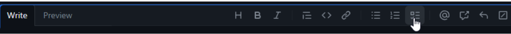

# GitHub and Project Management

## Guidelines

These guidelines are meant to ensure that issues are created in a standardized format and contain sufficient detail so we know what needs to be done, how much effort is involved, and how to prioritize it against other issues.

1. Title: This can be short, but should give enough detail to identify what work this issue is related to and differentiate it from similar task. For example, “Review Documentation for [Specific Project Name]”, as opposed to “Review Documentation” which is too vague.
2. Description: This should be detailed enough that anyone viewing the issue knows what work needs to be done, and what the ideal outcome or deliverable is once this work is complete (success criteria).
    1. If the work can be broken out into subtasks, make use of the checklist format option to list those subtasks.
    
    2. Meta-issues: If the issue is sized Large (1-2 weeks of work) or X-Large (more than 2 weeks of work), turn it into a meta-issue. The subtasks should be turned into their own issues and linked back to this issue. This should also be done if subtasks need to be assigned to someone other than the primary driver of the issue.
    3. Sub-task issues should be sized appropriately so that they can be completed in <1 sprint of work. So Tiny (1 hour), Small (1 day), and Medium (1 week) are appropriate sizes for sub-tasks. A Large (2+ weeks) or X-Large (months) task should be broken up into smaller components and turned into a meta-issue.
    4. Example Meta-Issue: Note that in the screenshot below, there is text between the check-box and the issue name. This will prevent the automation that checks the box when the issue is closed from working. To enable that automation, there should be no text in the check-box besides the issue name.
    

3. The following items should always be filled in when creating a new issue. If you are unsure what to enter, reach out to the Project Manager to discuss, or bring it up in daily standup or weekly sprint planning meetings to discuss with the team.
    1. Assignee: If you are unsure who to assign the item to, assign it to yourself to avoid losing track of the issue. Then add a comment that you think it may need to be assigned to someone else and we can discuss in the next team meeting.
    2. Priority: Indicates how soon the work needs to start. See definitions in the appendix at the end of this document.
    3. Size: Size indicates how much time the work will take to complete once it has started. See definitions in the appendix at the end of this document.
    4. Sprint: If the work will start within the next 6 weeks, assign it either to the current or next 2-3 sprints. Work planned further than 3 sprints out does not need to be assigned to a sprint. In this case set the status to “Backlog” and assign a Due Date. If there is not a known due date for the work, this should be a date by which the work needs to be added to a sprint so it does not get lost.
    5. Project: This field is important because it ensures the issue is surfaced in the correct location. If you are unsure of the project, the Project Manager can help identify the correct selection.
        1. Projects associated with DIF work start with “DIF - “ followed by the project name.
        2. Tasks related to overall ODI infrastructure changes not tied to a specific project can go in the appropriate Infrastructure projects. This should be used by DSE team members only.
    6. Milestone: Most DIF projects have Milestones which map to our project timelines. There is a search function which can help identify the correct milestone for the work being done. The Project Manager can help if you are not sure of the correct milestone.
        1. Note: If a project repo does not have milestones created (for example the ODI data-infrastructure repo) then this can be left blank.
    7. Due Date: Assign a due date when the work needs to be completed by, if applicable. If there is no set due date this can be left blank.
    8. Status: Assign a status on the current state of the issue. See below for status options.
4. Pull Requests: Add phrase “(Fixes/Closes/Resolves) #xx” to ensure the referenced issue gets closed when PR is merged
    1. Review “Open PRs” tab during stand up
5. Make sure to fully close an issue when completed.

## Size Definitions

**Tiny**

- Easy task, something that can be completed in about an hour May not require issue creation but could use as a reminder to complete the task later in the sprint (if something takes less than 30 minutes, no need for an issue).
- Example: Sending a follow-up email

**Small**

- A task that can be completed in one day

**Medium**

- A task that can be completed in about a week
- More complex but still straightforward to complete

**Large**

- A task that can be completed in 2 or more weeks
- Increased complexity, may require slower manual work or unknowns that require research and discovery

**X-Large**

- Tasks that may take a month or longer to complete
- Consider breaking up into sub-tasks if appropriate, or create a meta-issue when there are dependencies
- Example: Building a data model

## Priority Definitions

**Urgent**

- Top priority / emergency
- Putting everything else on backburner
- Aiming for completion ASAP
- Due Date assigned must be kept

**High**

- Important, goal is to complete this sprint
- Due Date should be kept as much as possible

**Medium**

- Less important than High, aim to complete within 2-4 sprints
- Due Date is a target but OK to push back

**Low**

- Work on as time allows, may leave in backlog
- Due Date not required or kept as a reminder to check back and move out of backlog by a certain point in time

## Status Definitions

1. **New**: Default for new issues. If discussion is needed to clarify details about the issue leave it as New until that discussion happens (so it appears in the “New Status” Project Board view).
2. **Backlog**: If work is not planned on this within the next 2-3 sprints, set the Status to Backlog (or Blocked if the work is blocked for any reason) and do not assign it to a sprint.
3. **TODO**: If the issue is assigned to a sprint but work has not started yet, set the status as TODO.
4. **In Progress**: Choose this status once work has started on the issue.
5. **Needs Review**: Indicates that review is needed from other team members.
6. **Blocked**: Choose this if work on the issue cannot move forward due to something outside of your team’s control, for example if waiting on another team to respond to a question.
7. **Paused**:
8. **Done**: Indicates the issue is completed. This status is set automatically when the issue is closed, you do not need to select it.
    1. Note: The correct way to close an issue is to scroll to the bottom of the issue page and choose “Close Issue”.
