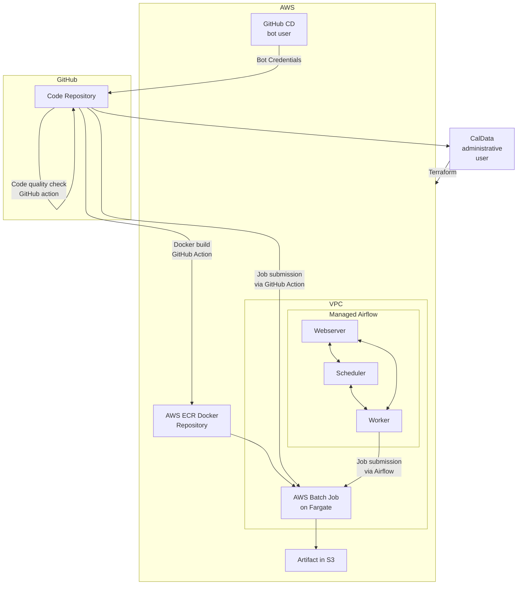

# Cloud Infrastructure

The DSE team [uses Terraform](../code/terraform-local-setup.md) to manage cloud infrastructure.
Our stack includes:

* An [AWS Batch](https://aws.amazon.com/batch/) environment for running arbitrary containerized jobs
* A [Managed Workflows on Apache Airflow](https://aws.amazon.com/managed-workflows-for-apache-airflow/) environment for orchestrating jobs
* A VPC and subnets for the above
* An ECR repository for hosting Docker images storing code and libraries for jobs
* A bot user for running AWS operations in GitHub Actions
* An S3 scratch bucket

## Architecture

