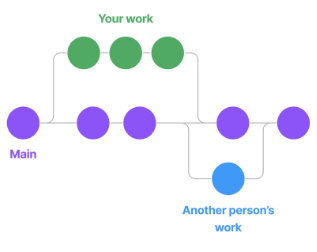
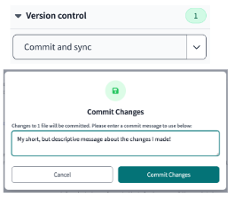
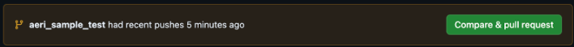
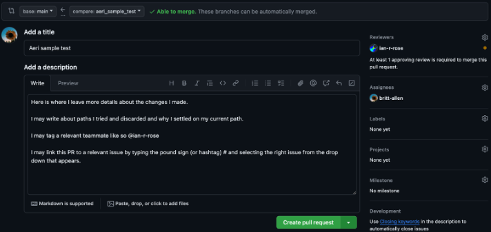
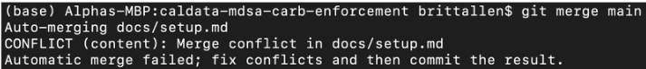
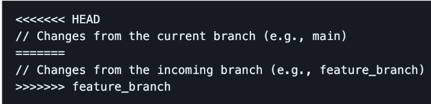
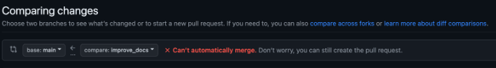
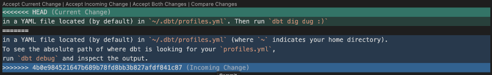
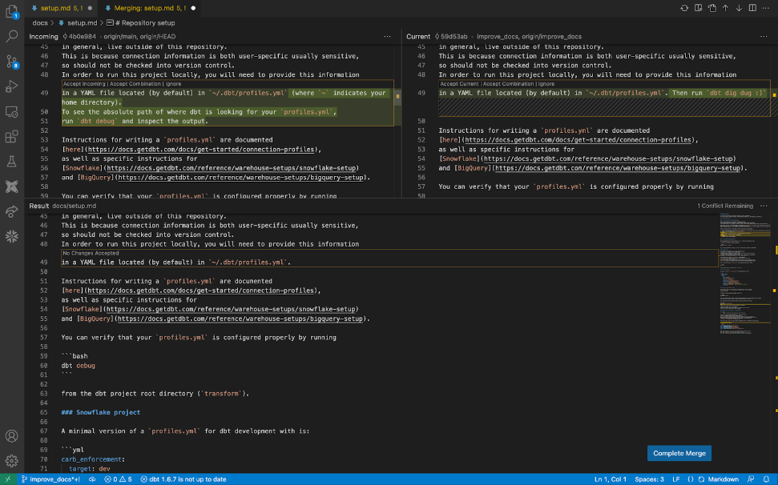

# git and GitHub

## What are git and GitHub?

Git and GitHub occupy central positions in modern software development practices.

Git is software that you install locally on your machine that enables source code management (SCM).
Code is organized into folder-like structures called git repositories,
which enables you to track the history of code,
safely develop features in side branches,
and collaborate with others in a distributed fashion.
Git is a distributed version control system, which means that each developer has a local copy of the entire code repository. This makes it easy to work on code offline and to share changes with other developers.

GitHub is a web platform for hosting git repositories.
It integrates tightly with local git development workflows,
and includes additional features like a code review user interface,
issue tracking, project boards,
[continuous integration/continuous delivery](https://www.atlassian.com/continuous-delivery/principles/continuous-integration-vs-delivery-vs-deployment),
and social networking.
There are a number of web platforms which have similar features and goals as GitHub
(including Bitbucket and GitLab), but GitHub is the most commonly used.

Git and GitHub are essential tools for software development. They allow developers to track changes to code, collaborate, and share open or closed-source code.

## Learning git

There are many high-quality resources for learning git online. Here are a few:

* Atlassian has an excellent set of tutorials for learning git, including:
    * [A conceptual overview for beginners](https://www.atlassian.com/git/tutorials/what-is-version-control)
    * [How to set up a repository](https://www.atlassian.com/git/tutorials/setting-up-a-repository)
    * [How to use git to collaborate with others](https://www.atlassian.com/git/tutorials/syncing)
* GitHub has a nice [cheat-sheet](https://education.github.com/git-cheat-sheet-education.pdf) for common git commands
* The [official git documentation](https://git-scm.com/doc) is not always the most user-friendly, but it has a depth of information that isn't available elsewhere

## Learning GitHub

In addition to the fundamentals of git,
it's also helpful to know how to use the GitHub web platform for development.
GitHub hosts an excellent set of [interactive tutorials](https://skills.github.com/)
for learning to use its various features, including:

* [An introduction to GitHub](https://github.com/skills/introduction-to-github)
* [How to use Markdown for issues and READMEs](https://github.com/skills/communicate-using-markdown)
* [How to review pull requests](https://github.com/skills/review-pull-requests)
* [How to automate tasks and use CI/CD with GitHub actions](https://github.com/skills/hello-github-actions)

## git and GitHub at CalData

On the CalData Data Services and Engineering team we make heavy use of git and GitHub for our projects,
and have our own set of [guidelines and best practices](../code/code-review.md) for code review.

## Resources

-  Install [Git for Windows](https://git-scm.com/downloads) or [GitHub for Desktop](https://desktop.github.com/)
-  Bookmark GitHub’s [Git Cheat Sheet](https://education.github.com/git-cheat-sheet-education.pdf)

## Clone the project repo locally (for MacOS or Linux-based CLI)

1. Go to your command line
2. Type `cd ~`
3. Type `git clone https://github.com/[repository_name].git`

## Clone the project repo locally (with GitHub Desktop)

1. Follow these instructions: [install GitHub Desktop](docs.github.com/en/desktop/installing-and-authenticating-to-github-desktop/installing-github-desktop)
2. Be sure to login with the GitHub username you are using for this project
3. Be sure to select the cagov/[repository_name] repository to clone.

## Pull Requests
A pull request (PR) is a way to propose changes to a code repository. It is a formal request to the repository owner(s) to merge your changes into their codebase, often the “main” branch.

PRs are typically created by cloning or forking the repository, making changes to the code, and then submitting a request to the repository owner to merge your changes. The repository owner can then review your changes, request changes – if necessary, and decide whether to merge them into their codebase.

Here are some of the benefits of using PRs:

- **Collaboration**: PRs allow developers to collaborate on code and share ideas.
- **Code review**: PRs allow other developers to review your changes and provide feedback.
- **Testing**: PRs can be used to test changes before they are merged into the main codebase.
- **Documentation**: PRs can be used to document changes to the code.
- **History**: PRs provide a history of changes to the code.

## Creating or switching branches

1. Go to your Repository > https://github.com/cagov/[repsoitory_name]
2. Click on the Branch Dropdown
    1. On the main page of your repository, you'll see a dropdown menu on the top left, displaying the current branch (usually “main”). Click on this dropdown.
3. Type or click on an Branch Name
    1. In the dropdown that appears, there’s a textbox at the top, type the name for the branch you want to switch to or create.
    2. When creating a new branch, choose a descriptive and relevant name. e.g. `project_staging_model`
    3. **If you’re just switching branches you are done after this step!**
4. Choose a base for the New Branch
    1. Usually this is “main” as you want to work off of the most up-to-date version of code, but you can also choose another branch to base your new one off of if you want to add to someone else’s work in progress without making edits directly to their branch and causing a merge conflict! 😬
5. Click "Create branch `<branch_name>` from `<base_branch_name>`" (usually your base branch will be “main”)

Now, you have successfully created a new branch in your GitHub repository and will be automatically switched to this branch. You can make changes on this new branch without affecting the main branch.

If you're working with git locally, you can create and switch branches as well as check your current git branch using the following git commands:

- **Create and switch to a branch:** `git switch -c <branch_name>`
    - **This also works, but is the older way of doing it:** `git checkout -b <branch_name>`
- **Switch to an existing branch:** `git switch <branch_name>`
    - If this doesn’t work it’s likely that you have to pull down the remote branch you want to work with first using `git fetch`
    - Then you can run git switch `<branch_name`> again

!!! note
        Replace `<branch_name>` with the actual name of your new branch e.g. `writing_project_docs`.

- Check which branch you are on: `git branch --show-current`
- Optional – persistently show your full path and branch name in command line:

**Mac OS**

- Type `open ~/.bash_profile`
- In the file that opens, add the following at the bottom of the file:

    `parse_git_branch() {
    git branch 2> /dev/null | sed -e '/^[^*]/d' -e 's/* \(.*\)/ (\1)/'
    }
    export PS1="\u@\h \[\033[32m\]\w -\$(parse_git_branch)\[\033[00m\] $ "`

**Windows OS (Linux-based)**

- If you do not have git bash installed please download it [here](https://git-scm.com/download/win)
- Showing branch names is a built-in feature of git bash. If branches do not show in your command prompt, follow the following steps.
- Download the official git-prompt script. Move it to somewhere accessible to git bash (e.g. `~/.git-prompt.sh`)
- Add the following 2 lines to your ~/.bashrc file:

    `source ~/.git-prompt.sh
    export PS1='\[\033[32m\]\u@\h \[\033[35m\]\w\[\033[36m\]$(__git_ps1 " (%s)")\[\033[0m\]\$ '`

**Follow the remaining steps regardless of OS**

- Save the file and close it
- Open a new terminal window
- Type `cd ~/[folder_name]/`
- You’ll now see something like this:

**Staging and committing changes**

1. Create or switch your branch
    1. Make sure you’re on the branch you want to commit changes to (you almost never want to commit directly to “main”). If you just created a branch you are likely already on the branch you want to make changes to, if not switch to it.
    2. To create or switch branches, follow the steps above
2. Navigate to the file you want to modify and make the necessary changes
    1. Whether you’re editing a file in dbt Cloud, locally with a code editor like VS Code, or directly in GitHub (not recommended) you must click SAVE or use CTRL/COMMAND S. To save the changes to your file BEFORE you commit them
1. Stage your changes
    1. We’ll skip how to do this in GitHub because we don’t recommend editing and committing changes directly in GitHub as this doesn’t allow you to run linting tools that can help you catch errors BEFORE you push and change. We will have CI checks set up on the project repo that will help catch database, formatting, SQL errors etc.
    2. Locally this is done by:
        1. Typing `git add <file_name.file_extension>`
        2. You can use `git add .` to add ALL files you’ve edited. This can be a dangerous operation because you may accidentally stage files you made changes to but did not want to be added to the project repo. For instance you could have made changes to a file that may contain sensitive information. Only use `git add .` if you are sure all files are safe to stage!
    3. In dbt Cloud the git add process is handled under the hood so be sure that every file you edit is actually a file you want to later commit, if not you must revert changes to any files you do not want to commit.
4. Commit your changes
    1. Again we’ll skip how to do this in GitHub – we do not recommend it!
    2. Locally this is done with: `git commit -m “<a short message about the changes you made>”`
    3. In dbt Cloud this is is done by:
        1. Clicking the “commit and sync” button
        2. Then type a short, yet descriptive message about the changes you made in the text box that appears and click “Commit Changes”

**Pushing your changes**

1. Locally this is done with: `git push origin <branch_name>`
2. In dbt Cloud this is also done under the hood when you click “Commit Changes”

**Opening a PR**

**Option 1**:
This works whether you commit changes locally or via dbt Cloud

1. Go to the GitHub repository where you just pushed your changes
2. At the top of the home page you’ll see a message like the one below. It’ll say “`<your_branch_name>` had recent pushes X minutes ago” with a green button that says “Compare & pull request”. Click that button

3. Next you’ll be taken to a new screen like the one shown below.

4. From here you’ll:
    1. Check that your branch is “Able to merge” (as seen in the upper center of the screen with a preceding green checkmark)
        1. If you see “Can’t automatically merge.” that means you have a merge conflict. We cover how to resolve merge conflicts below.
    2. Add a more descriptive title and detailed description
    3. Add yourself as an Assignee
    4. Select a teammate as a Reviewer
    5. You’ll have options to fill in other details like projects, we’ll cover those later
5. Click the green button on the lower right that says “Create pull request”

!!! note
        This option only works for an hour after you have pushed your changes. If you don’t open a pull request within that 60 minute window this button will disappear. Fear not! There is a second way to open a pull request outlined below.

**Option 2**:
This is the option to use if you cannot follow step 2 in Option 1.

1. Go to the Pull requests page on GitHub by going directly to this link or go to the repo homepage and click on the “Pull requests” tab near the top as pictured below

2. Click the green “New pull request” button in the upper right corner
3. You’ll be taken to a new window
4. Click the button that says “compare: main”
5. A dropdown will open, from there you can either type or click the name of the branch you want to compare to the “base: main” branch.
6. After you select the branch follow steps 3 through 5 from Option 1 above

**Option 3**: You have a third option to open a PR in dbt Cloud if you don’t choose to follow the steps of one of the two options above.

1. After you commit your changes you’ll see a light green button on the upper left that says “Create a pull request on GitHub”. This will only appear if you’ve yet to open a PR. If you have already opened a PR and are simply committing more changes to it you will not see this option.

## Reviewing a PR

The ODI CalData team put together [documentation on reviewing a PR](https://cagov.github.io/data-infrastructure/code-review/#reviewing-a-pull-request) with the two core messages being, have empathy and get CI (continuous integration) to pass.

1. Navigate to the PR
    1. Go to the the “Pull Requests” tab in project repository where the PR was opened and find the PR you want to review
    2. You can also find PRs where you are the requested reviewer by going directly to this link: github.com/pulls/review-requested
2. Review the changes
    1. GitHub will take you to the home screen of the PR which starts on the “Conversation” tab. This is where you can read any commits by the PR author, anyone involved in review, and any automated tools.
    2. The “Commits” tab is where you can check each save to the PR to understand the sequence of changes
    3. The “Checks” tab is where you can see the jobs run by GitHub actions (CI automations). You can see whether or not they pass or fail and the details of each.
    4. There will be a yellow pane across the top of this page like pictured below.

Clicking the green “Add your review” button will take you to the “Files changed” tab where you can begin your review.

In the files changed tab you can leave a comment on any line of code by clicking the blue plus sign that appears when you hover. You can leave a single comment that is not part of a review or leave comments as part of your review. You can suggest changes here too which we’ll cover in the next section.

After you’re done with your review, if you scroll back to the top there will be a green button on the upper right that says “Finish your review”. Click that and decide if you just want to do one of the following: 1) Comment, 2) Approve or 3) Request changes. Then click the green button on the lower right that says “Submit review”.

## Suggesting changes to a PR

When you’re reviewing a PR instead of just commenting on a line of code you may want to suggest changes directly to the code. You can do this by clicking the blue plus sign button next to the line of code you want to suggest changes to.

In the window that opens click the button that has a + and - sign as pictured below.

In this example, “test” is misspelled so the PR review is adding a suggestion and fixing the code with the correct spelling. If the PR author agrees they can seamlessly accept this suggestion and integrate it into their code.

After adding your suggestion and additional comments if applicable, click the green “Start a review” button.

## Resolving a merge conflict

Merge conflicts occur in git when the software is unable to automatically merge changes from two different branches. This happens when changes are made to the same part of a file in both the source and target branches (these are often interchanged as feature and destination branches, respectively) and git is unable to determine which of the changes should be kept.

Below we’ll step through a more detailed explanation of how a merge conflict happens and how to resolve it:

1. Parallel changes occur
    1. Let’s say you’re working on a branch called feature_branch where you’re working on a file called docs.md. Meanwhile, a teammate makes changes to that same file in another branch feature_branch_2 that gets merged to the main branch before yours does.
2. Git attempts a merge
    1. When you try to merge feature_branch into the main branch, git will attempt to merge the changes. If the changes are in different parts of the same file, git can usually merge them seamlessly.
3. Conflict arises
    1. If changes are made to the same part of the same file in both branches, git will detect a conflict. It is unable to reconcile the differences in files as it doesn’t know which changes to keep and which to discard.
4. Conflict markers
    1. If attempting to merge from your command line you’ll see the following
    
    2. Git will also mark the conflicting sections of the file with special markers. The conflicting changes from both branches are placed between these markers. Like you see below
    
    3. If you navigate to GitHub to create a pull request you’ll see the following
    
5. Resolution
    1. Manually
        1. To resolve the conflict you need to manually edit the file to choose what changes to keep. Remove the conflict markers and any code that is not needed.
        2. After you resolve the conflict you’ll need to stage the file again with `git add <file_name.file_extension>`
        3. You’ll need to commit the changes again with `git commit - m “<a short message about the changes you made>”`
        4. Type `git merge --continue`
        5. Finally, type `git push origin main`
    2. In VS Code
        1. You’ll see the following along with a UI to actually help you decide which changes to keep
        
        2. In the lower right corner of your screen you’ll see a blue button that says “Resolve in Merge Editor”. Click this button.
        3. Next you’ll be taken to a screen like you see below. On this screen you’ll have options on either side of your Incoming and Current changes to select the following options: _Accept_ _Incoming_ | _Accept_ _Combination_ | _Ignore_
        4. Select the appropriate option, this may require discussion with your team.
        5. After you decide which changes to keep, click the blue “Complete Merge” button in the lower right corner of  your screen
        

To avoid or reduce the occurrence of merge conflicts, it’s a good practice to regularly pull changes from the main branch into your feature branch. Open communication with your team about changes will also help prevent conflicts.

## Merging a PR
As a reviewer you have the responsibility to merge a PR after you approve it. PRs should not be merged if any of the following are true:
- All CI checks have not passed (2 out of 3 passing isn’t good enough)
- You haven’t approved the PR
- Requested changes have not be addressed or planned for in another PR
- The ‘Merge pull request” button is green

If no changes are needed or if requested changes are made and all CI checks have passed, you can merge the PR by clicking the “Merge pull request’ button on the “Conversation” tab of the PR.

After you click this,  GitHub will prompt you to choose which email to associate with the commit and then to click the “Confirm merge” button.

At this point, GitHub will finalize the merge process and these changes will now be incorporated into the main branch. You may delete the feature branch that was used to submit the PR.

## GitHub Issues

Issues on GitHub are how we document and track our work. Writing a good issue is important because it provides clear information on the what, why, and who relating to a body of work which can enable efficient collaboration. Well documented issues allow for quicker understanding and problem resolution. They serve as a form of documentation capturing decisions and discussion which is valuable to reference for current and future team members. Clear issues also help with task prioritization and milestone tracking across our work.

## Creating an issue

1. Go to the “Issues” tab of the project repository
2. Find and click on the green “New issue” button in the upper right corner
3. At a minimum your issue should have 5 main elements and 5 more sub-elements.
    1. A clear, concise, and descriptive title
    2. A detailed description of the issue
    3.An assignee, usually yourself, but you may assign someone else more appropriate
    4. A project it corresponds to
    5. After the issue is created click on the dropdown next to your project in the “Projects” section on the right side of your issue. Add the following details:
        1. Status (Backlog, To do, In progress, Needs Review, Blocked, etc.)
        2. Priority (e.g. Urgent, High, Medium, Low)
        3. Size (X-Large, Large, Medium, Small, Tiny)
        4. Sprint (either current or future)
        5. Project (e.g. DIF - Caltrans)
4. A relevant milestone that this issue fits into

Here is [an example GitHub issue] (https://github.com/cagov/caldata-mdsa-caltrans-pems/issues/31)that has all 10 elements and sub-elements listed above.

## Writing Markdown

Writing markdown is important to learn when creating project documentation in markdown files (.md) and for writing GitHub issues. GitHub has [handy documentation on basic Markdown syntax](https://docs.github.com/en/get-started/writing-on-github/getting-started-with-writing-and-formatting-on-github/basic-writing-and-formatting-syntax) which is a great starting point.

## GitHub Magic ✨
1. Linking PRs to Issues and Issues to PRs
    1. You can do this by going to the “Development” section of your issue on the right hand side underneath “Milestone”. Click on the cog wheel then select the relevant repository the PR lives in. From there type in the number (e.g. 266) or title of the PR you want to link or select it from the dropdown that appears.
    2. You can also do this by using a keyword like “closes, fixes, or resolves” followed by # and the issue number, e.g. [Fixes #143](https://github.com/cagov/data-infrastructure/pull/172)
    3. When you use the “closes” keyword, this will close the corresponding issue when the PR is merged
    4. For a full list of [keywords you can use to link a PR to an issue checkout GitHub’s documentation](https://docs.github.com/en/issues/tracking-your-work-with-issues/linking-a-pull-request-to-an-issue) complete with examples
2. Tagging a teammate
    1. This is done by typing @ and selecting or typing your teammate’s username in the pop-up window that appears
    2. You can tag teammates in your commit message, issue or PR comments, and issue descriptions
