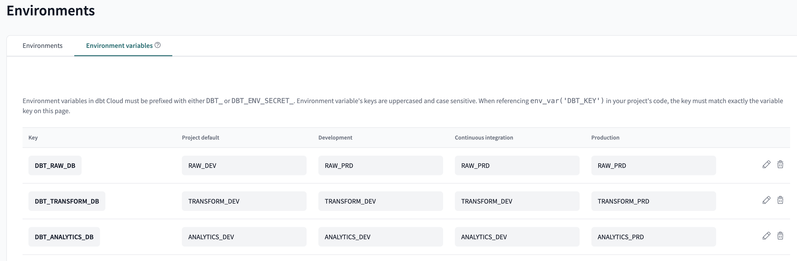

# dbt project setup

To set up a new project on dbt Cloud follow these steps:

1. Give your new project a name.
1. Click _Advanced settings_ and in the _Project subdirectory_ field, enter "transform"
1. Select a data warehouse connection. (e.g. Snowflake, BigQuery, Redshift)
1. For the _Development credentials_ section you'll want to choose between Snowflake OAuth or Key pair. In general, Snowflake OAuth is preferred for human users (which is what the development environment is for). It is also an enterprise dbt Cloud feature, so if working with a standard account, you'll need to use key pair.

   1. For Snowflake OAuth:

      1. Follow dbt's instructions for set up [here](https://docs.getdbt.com/docs/cloud/manage-access/set-up-snowflake-oauth)

   1. For Key pair:
      1. Under _Auth method_ select _Key pair_
      1. Enter your data warehouse username
      1. Enter the private key and private key passphrase
      1. For more guidance, read [dbt's docs on connecting to Snowflake via key pair](https://docs.getdbt.com/docs/cloud/connect-data-platform/connect-snowflake#key-pair)

1. Finally click the _Test Connection_ button.
1. Connect the appropriate repository. Read [dbt's docs on connecting to GitHub](https://docs.getdbt.com/docs/cloud/git/connect-github) or [dbt's docs on connecting to Azure DevOps](https://docs.getdbt.com/docs/cloud/git/setup-azure#register-an-azure-ad-app) and [Microsoft's docs on creating branch policies in DevOps](https://learn.microsoft.com/en-us/azure/devops/repos/git/pr-status-policy?view=azure-devops).

Once you're through the first five steps you can return to the dbt homepage and click the Settings button in the upper right corner. From there you can follow the steps to configure three environments for Continuous integration - CI, development, and production. Read [dbt's docs on CI in dbt Cloud](https://docs.getdbt.com/docs/deploy/continuous-integration). Read [dbt's docs on creating production (deployment) environments](https://docs.getdbt.com/docs/deploy/deploy-environments) and [dbt's docs on creating and scheduling deploy jobs](https://docs.getdbt.com/docs/deploy/deploy-jobs#create-and-schedule-jobs).

You'll also want to [configure notifications for job failures](https://docs.getdbt.com/docs/deploy/job-notifications).

Pictured below is an example of environment variables you can set for each environment. For more guidance, read [dbt's docs on environment variables](https://docs.getdbt.com/docs/build/environment-variables).

