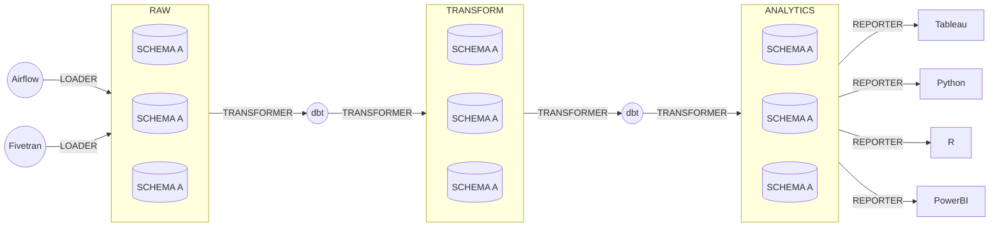

# Snowflake

We use Snowflake as our primary data warehouse.

## Architecture

The setup of our account is adapted from the approach described in
[this dbt blog post](https://www.getdbt.com/blog/how-we-configure-snowflake/),
which we summarize here.

!!! note
    We have development and production environments, which we denote with `_DEV`
    and `_PRD` suffixes on Snowflake objects. For that reason, some of the names here
    are not exactly what exists in our deployment, but are given in the un-suffixed
    form for clarity.

### Three databases

We have three primary databases in our account:

1. **`RAW_{env}`**: This holds raw data loaded from tools like Fivetran or Airflow. It is strictly permissioned, and only loader tools should have the ability to load or change data.
1. **`TRANSFORM_{env}`**: This holds intermediate results, including staging data, joined datasets, and aggregations. It is the primary database where development/analytics engineering happens.
1. **`ANALYTICS_{env}`**: This holds analysis/BI-ready datasets. This is the "marts" database.

### Three warehouse groups

There are warehouse groups for processing data in the databases,
corresponding to the primary purposes of the above databases.
They are available in a few different sizes, depending upon the needs of the the data processing job,
X-small (denoted by (`XS`), X-Large (denoted by (`XL`), and 4X-Large (denoted by `4XL`).
Most jobs on small data should use the relevant X-small warehouse.

1. **`LOADING_{size}_{env}`**: These warehouse is for loading data to `RAW`.
1. **`TRANSFORMING_{size}_{env}`**: This warehouse is for transforming data in `TRANSFORM` and `ANALYTICS`.
1. **`REPORTING_{size}_{env}`**: This warehouse is the role for BI tools and other end-users of the data.

### Four roles

There are four primary functional roles:

1. **`LOADER_{env}`**: This role is for tooling like Fivetran or Airflow to load raw data in to the `RAW` database.
1. **`TRANSFORMER_{env}`**: This is the analytics engineer/dbt role, for transforming raw data into something analysis-ready. It has read/write/control access to both `TRANSFORM` and `ANALYTICS`, and read access to `RAW`.
1. **`REPORTER_{env}`**: This role read access to `ANALYTICS`, and is intended for BI tools and other end-users of the data.
1. **`READER_{env}`**: This role has read access to all three databases, and is intended for CI service accounts to generate documentation.

## Access Roles vs Functional Roles

We create a two layer role hierarchy according to Snowflake's
[guidelines](https://docs.snowflake.com/en/user-guide/security-access-control-considerations#aligning-object-access-with-business-functions):

* **Access Roles** are roles giving a specific access type (read, write, or control) to a specific database object, e.g., "read access on `RAW`".
* **Functional Roles** represent specific user personae like "developer" or "analyst" or "administrator". Functional roles are built by being granted a set of **Access Roles**.

There is no technical difference between access roles and functional roles in Snowflake. The difference lies in the semantics and hierarchy that we impose upon them.

## Security Policies

Our security policies and norms for Snowflake are following the best practices laid out in
[this article](https://community.snowflake.com/s/article/Snowflake-Security-Overview-and-Best-Practices),
[these overview docs](https://docs.snowflake.com/en/guides-overview-secure),
and conversations had with our Snowflake representatives.

### Use Federated Single Sign-On (SSO) and System for Cross-domain Identity Management (SCIM) for human users

Most State departments will have a federated identity provider for SSO and SCIM.
At the Office of Data and Innovation, we use [Okta](https://www.okta.com/).
Many State departments use [Active Directory](https://azure.microsoft.com/en-us/products/active-directory/).

Most human users should have their account lifecycle managed through SCIM, and should log in via SSO.

Using SCIM with Snowflake requires creating an authorization token for the account.
This token should be stored in DSE's shared 1Password vault,
and needs to be manually rotated every six months.

### Enable multi-factor authentication (MFA) for users

Users, especially those with elevated permissions, should have multi-factor authentication enabled for their accounts.
In some cases, this may be provided by their SSO identity provider, and in some cases this may use the built-in Snowflake MFA using Duo.

### Use auto-sign-out for Snowflake sessions

Ensure that `CLIENT_SESSION_KEEP_ALIVE` is set to `FALSE` in the account.
This means that unattended browser windows will automatically sign out after a set amount of time (defaulting to one hour).

### Follow the principle of least-privilege

In general, users and roles should be assigned permissions according to the
[Principle of Least Privilege](https://en.wikipedia.org/wiki/Principle_of_least_privilege),
which states that they should have sufficient privileges to perform
legitimate work, and no more. This reduces security risks should a particular
user or role become compromised.

### Create service accounts using Terraform

Service accounts aren't associated with a human user.
Instead, they are created by an account administrator for
the purposes of allowing another service to perform some action.

We currently use service accounts for:

* Fivetran loading raw data
* Airflow loading raw data
* dbt Cloud for transforming data
* GitHub actions generating docs

These service accounts are created using Terraform
and assigned roles according to the principle of least-privilege.
They use key pair authentication, which is more secure than password-based authentication as no sensitive data are exchanged.
Private keys for service accounts should be stored in CalData's 1Password vault.

The following are steps for creating a new service account with key pair authentication:

1. Create a new key pair in accordance with [these docs](https://docs.snowflake.com/en/user-guide/key-pair-auth#configuring-key-pair-authentication).
  Most of the time, you should create a key pair with encryption enabled for the private key.
1. Add the private key to the CalData 1Password vault, along with the intended service account user name and passphrase (if applicable)
1. Create a new user in the Snowflake Terraform configuration (`users.tf`) and assign it the appropriate functional role.
  The public key of the key pair should be attached to the user using the property `rsa_public_key`.
  Note that we need to remove the header and trailer (i.e. `-- BEGIN PUBLIC KEY --`) as well as any line breaks
  in order for Snowflake to accept the public key as valid.
  It is okay for this public key to be in version control.
1. Add the *private* key for the user to whatever system needs to access Snowflake.

Service accounts should not be shared across different applications,
so if one becomes compromised, the damage is more isolated.

### Regularly review users with elevated privileges

Users with access to elevated privileges (especially the `ACCOUNTADMIN`, `SECURITYADMIN`, and `SYSADMIN` roles)
should be regularly reviewed by account administrators.

## Snowflake Terraform configuration

We provision our Snowflake account using [terraform](https://github.com/Snowflake-Labs/terraform-provider-snowflake).

The infrastructure is organized into three modules, two lower level ones and one application-level one:

* **database**: A module which creates a Snowflake database and access roles for it.

* **warehouse**: A module which creates a Snowflake warehouse and access roles for it.

* **elt**: A module which creates several **database** and **warehouse** objects and implements the above architecture for them.

The **elt** module is then consumed by two different terraform deployments:

* **dev** for dev infrastructure
* **prd** for production infrastructure.

The **elt** module has the following configuration:

<!-- BEGIN_TF_DOCS -->
## Requirements

| Name | Version |
|------|---------|
|  [terraform](#requirement\_terraform) | >= 1.0 |
|  [snowflake](#requirement\_snowflake) | ~> 0.61 |

## Providers

| Name | Version |
|------|---------|
|  [snowflake.useradmin](#provider\_snowflake.useradmin) | ~> 0.61 |

## Modules

| Name | Source | Version |
|------|--------|---------|
|  [analytics](#module\_analytics) | ../database | n/a |
|  [loading](#module\_loading) | ../warehouse | n/a |
|  [raw](#module\_raw) | ../database | n/a |
|  [reporting](#module\_reporting) | ../warehouse | n/a |
|  [transform](#module\_transform) | ../database | n/a |
|  [transforming](#module\_transforming) | ../warehouse | n/a |

## Resources

| Name | Type |
|------|------|
| [snowflake_role.loader](https://registry.terraform.io/providers/Snowflake-Labs/snowflake/latest/docs/resources/role) | resource |
| [snowflake_role.reader](https://registry.terraform.io/providers/Snowflake-Labs/snowflake/latest/docs/resources/role) | resource |
| [snowflake_role.reporter](https://registry.terraform.io/providers/Snowflake-Labs/snowflake/latest/docs/resources/role) | resource |
| [snowflake_role.transformer](https://registry.terraform.io/providers/Snowflake-Labs/snowflake/latest/docs/resources/role) | resource |
| [snowflake_role_grants.analytics_r_to_reader](https://registry.terraform.io/providers/Snowflake-Labs/snowflake/latest/docs/resources/role_grants) | resource |
| [snowflake_role_grants.analytics_r_to_reporter](https://registry.terraform.io/providers/Snowflake-Labs/snowflake/latest/docs/resources/role_grants) | resource |
| [snowflake_role_grants.analytics_rwc_to_transformer](https://registry.terraform.io/providers/Snowflake-Labs/snowflake/latest/docs/resources/role_grants) | resource |
| [snowflake_role_grants.loader_to_airflow](https://registry.terraform.io/providers/Snowflake-Labs/snowflake/latest/docs/resources/role_grants) | resource |
| [snowflake_role_grants.loader_to_sysadmin](https://registry.terraform.io/providers/Snowflake-Labs/snowflake/latest/docs/resources/role_grants) | resource |
| [snowflake_role_grants.loading_to_loader](https://registry.terraform.io/providers/Snowflake-Labs/snowflake/latest/docs/resources/role_grants) | resource |
| [snowflake_role_grants.raw_r_to_reader](https://registry.terraform.io/providers/Snowflake-Labs/snowflake/latest/docs/resources/role_grants) | resource |
| [snowflake_role_grants.raw_r_to_transformer](https://registry.terraform.io/providers/Snowflake-Labs/snowflake/latest/docs/resources/role_grants) | resource |
| [snowflake_role_grants.raw_rwc_to_loader](https://registry.terraform.io/providers/Snowflake-Labs/snowflake/latest/docs/resources/role_grants) | resource |
| [snowflake_role_grants.reader_to_github_ci](https://registry.terraform.io/providers/Snowflake-Labs/snowflake/latest/docs/resources/role_grants) | resource |
| [snowflake_role_grants.reader_to_sysadmin](https://registry.terraform.io/providers/Snowflake-Labs/snowflake/latest/docs/resources/role_grants) | resource |
| [snowflake_role_grants.reporter_to_sysadmin](https://registry.terraform.io/providers/Snowflake-Labs/snowflake/latest/docs/resources/role_grants) | resource |
| [snowflake_role_grants.reporting_to_reader](https://registry.terraform.io/providers/Snowflake-Labs/snowflake/latest/docs/resources/role_grants) | resource |
| [snowflake_role_grants.reporting_to_reporter](https://registry.terraform.io/providers/Snowflake-Labs/snowflake/latest/docs/resources/role_grants) | resource |
| [snowflake_role_grants.transform_r_to_reader](https://registry.terraform.io/providers/Snowflake-Labs/snowflake/latest/docs/resources/role_grants) | resource |
| [snowflake_role_grants.transform_rwc_to_transformer](https://registry.terraform.io/providers/Snowflake-Labs/snowflake/latest/docs/resources/role_grants) | resource |
| [snowflake_role_grants.transformer_to_dbt](https://registry.terraform.io/providers/Snowflake-Labs/snowflake/latest/docs/resources/role_grants) | resource |
| [snowflake_role_grants.transformer_to_sysadmin](https://registry.terraform.io/providers/Snowflake-Labs/snowflake/latest/docs/resources/role_grants) | resource |
| [snowflake_role_grants.transforming_to_transformer](https://registry.terraform.io/providers/Snowflake-Labs/snowflake/latest/docs/resources/role_grants) | resource |
| [snowflake_user.airflow](https://registry.terraform.io/providers/Snowflake-Labs/snowflake/latest/docs/resources/user) | resource |
| [snowflake_user.dbt](https://registry.terraform.io/providers/Snowflake-Labs/snowflake/latest/docs/resources/user) | resource |
| [snowflake_user.github_ci](https://registry.terraform.io/providers/Snowflake-Labs/snowflake/latest/docs/resources/user) | resource |

## Inputs

| Name | Description | Type | Default | Required |
|------|-------------|------|---------|:--------:|
|  [environment](#input\_environment) | Environment suffix | `string` | n/a | yes |

## Outputs

No outputs.
<!-- END_TF_DOCS -->
