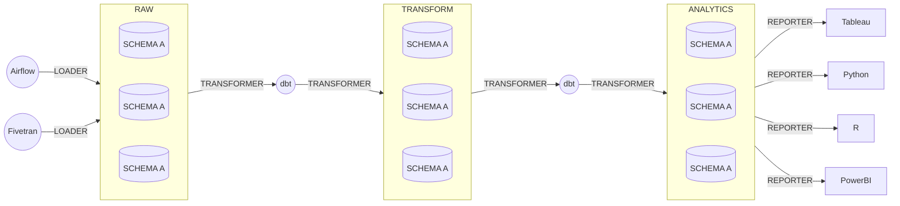

# Snowflake

We use Snowflake as our primary data warehouse.

## Architecture

The setup of our account is adapted from the approach described in
[this dbt blog post](https://www.getdbt.com/blog/how-we-configure-snowflake/),
which we summarize here:

### Three databases

We have three primary databases in our account:

1. **`RAW`**: This holds raw data loaded from tools like Fivetran or Airflow. It is strictly permissioned, and only loader tools should have the ability to load or change data.
1. **`TRANSFORM`**: This holds intermediate results, including staging data, joined datasets, and aggregations. It is the primary database where development/analytics engineering happens.
1. **`ANALYTICS`**: This holds analysis/BI-ready datasets. This is the "marts" database.

### Three warehouses

There are three primary warehouses for processing data in the databases, corresponding to the primary purposes of the above databases:

1. **`LOADING`**: This warehouse is for loading data to `RAW`.
1. **`TRANSFORMING`**: This warehouse is for transforming data in `TRANSFORM` and `ANALYTICS`.
1. **`REPORTING`**: This warehouse is the role for BI tools and other end-users of the data.

### Four roles

There are four primary functional roles:
1. **`LOADER`**: This role is for tooling like Fivetran or Airflow to load raw data in to the `RAW` database.
1. **`TRANSFORMER`**: This is the analytics engineer/dbt role, for transforming raw data into something analysis-ready. It has read/write/control access to both `TRANSFORM` and `ANALYTICS`, and read access to `RAW`.
1. **`REPORTER`**: This role read access to `ANALYTICS`, and is intended for BI tools and other end-users of the data.
1. **`READER`**: This role has read access to all three databases, and is intended for CI service accounts to generate documentation.

## Access Roles vs Functional Roles

We create a two layer role hierarchy according to Snowflake's
[guidelines](https://docs.snowflake.com/en/user-guide/security-access-control-considerations#aligning-object-access-with-business-functions):

* **Access Roles** are roles giving a specific access type (read, write, or control) to a specific database object, e.g., "read access on `RAW`".
* **Functional Roles** represent specific user personae like "developer" or "analyst" or "administrator". Functional roles are built by being granted a set of **Access Roles**.

There is no technical difference between access roles and functional roles in Snowflake. The difference lies in the semantics and hierarchy that we impose upon them.

## Security Policies

### Single Sign-On (SSO) and System for Cross-domain Identity Management (SCIM)

TODO

### User management

TODO

### Service accounts

## Snowflake Terraform configuration

We provision our Snowflake account using [terraform](https://github.com/Snowflake-Labs/terraform-provider-snowflake).

<!-- BEGIN_TF_DOCS -->
## Requirements

| Name | Version |
|------|---------|
|  [terraform](#requirement\_terraform) | >= 1.0 |
|  [snowflake](#requirement\_snowflake) | ~> 0.61 |

## Providers

| Name | Version |
|------|---------|
|  [snowflake.securityadmin](#provider\_snowflake.securityadmin) | 0.61.0 |
|  [snowflake.sysadmin](#provider\_snowflake.sysadmin) | 0.61.0 |
|  [snowflake.useradmin](#provider\_snowflake.useradmin) | 0.61.0 |

## Modules

No modules.

## Resources

| Name | Type |
|------|------|
| [snowflake_database.analytics](https://registry.terraform.io/providers/Snowflake-Labs/snowflake/latest/docs/resources/database) | resource |
| [snowflake_database.raw](https://registry.terraform.io/providers/Snowflake-Labs/snowflake/latest/docs/resources/database) | resource |
| [snowflake_database.transform](https://registry.terraform.io/providers/Snowflake-Labs/snowflake/latest/docs/resources/database) | resource |
| [snowflake_database_grant.analytics](https://registry.terraform.io/providers/Snowflake-Labs/snowflake/latest/docs/resources/database_grant) | resource |
| [snowflake_database_grant.raw](https://registry.terraform.io/providers/Snowflake-Labs/snowflake/latest/docs/resources/database_grant) | resource |
| [snowflake_database_grant.transform](https://registry.terraform.io/providers/Snowflake-Labs/snowflake/latest/docs/resources/database_grant) | resource |
| [snowflake_role.analytics](https://registry.terraform.io/providers/Snowflake-Labs/snowflake/latest/docs/resources/role) | resource |
| [snowflake_role.loader](https://registry.terraform.io/providers/Snowflake-Labs/snowflake/latest/docs/resources/role) | resource |
| [snowflake_role.loading](https://registry.terraform.io/providers/Snowflake-Labs/snowflake/latest/docs/resources/role) | resource |
| [snowflake_role.raw](https://registry.terraform.io/providers/Snowflake-Labs/snowflake/latest/docs/resources/role) | resource |
| [snowflake_role.reader](https://registry.terraform.io/providers/Snowflake-Labs/snowflake/latest/docs/resources/role) | resource |
| [snowflake_role.reporter](https://registry.terraform.io/providers/Snowflake-Labs/snowflake/latest/docs/resources/role) | resource |
| [snowflake_role.reporting](https://registry.terraform.io/providers/Snowflake-Labs/snowflake/latest/docs/resources/role) | resource |
| [snowflake_role.transform](https://registry.terraform.io/providers/Snowflake-Labs/snowflake/latest/docs/resources/role) | resource |
| [snowflake_role.transformer](https://registry.terraform.io/providers/Snowflake-Labs/snowflake/latest/docs/resources/role) | resource |
| [snowflake_role.transforming](https://registry.terraform.io/providers/Snowflake-Labs/snowflake/latest/docs/resources/role) | resource |
| [snowflake_role_grants.analytics_r_to_reader](https://registry.terraform.io/providers/Snowflake-Labs/snowflake/latest/docs/resources/role_grants) | resource |
| [snowflake_role_grants.analytics_r_to_reporter](https://registry.terraform.io/providers/Snowflake-Labs/snowflake/latest/docs/resources/role_grants) | resource |
| [snowflake_role_grants.analytics_rwc_to_transformer](https://registry.terraform.io/providers/Snowflake-Labs/snowflake/latest/docs/resources/role_grants) | resource |
| [snowflake_role_grants.analytics_to_sysadmin](https://registry.terraform.io/providers/Snowflake-Labs/snowflake/latest/docs/resources/role_grants) | resource |
| [snowflake_role_grants.loader_to_sysadmin](https://registry.terraform.io/providers/Snowflake-Labs/snowflake/latest/docs/resources/role_grants) | resource |
| [snowflake_role_grants.loading_to_loader](https://registry.terraform.io/providers/Snowflake-Labs/snowflake/latest/docs/resources/role_grants) | resource |
| [snowflake_role_grants.loading_to_sysadmin](https://registry.terraform.io/providers/Snowflake-Labs/snowflake/latest/docs/resources/role_grants) | resource |
| [snowflake_role_grants.raw_r_to_reader](https://registry.terraform.io/providers/Snowflake-Labs/snowflake/latest/docs/resources/role_grants) | resource |
| [snowflake_role_grants.raw_r_to_transformer](https://registry.terraform.io/providers/Snowflake-Labs/snowflake/latest/docs/resources/role_grants) | resource |
| [snowflake_role_grants.raw_rwc_to_loader](https://registry.terraform.io/providers/Snowflake-Labs/snowflake/latest/docs/resources/role_grants) | resource |
| [snowflake_role_grants.raw_to_sysadmin](https://registry.terraform.io/providers/Snowflake-Labs/snowflake/latest/docs/resources/role_grants) | resource |
| [snowflake_role_grants.reader_to_sysadmin](https://registry.terraform.io/providers/Snowflake-Labs/snowflake/latest/docs/resources/role_grants) | resource |
| [snowflake_role_grants.reporter_to_sysadmin](https://registry.terraform.io/providers/Snowflake-Labs/snowflake/latest/docs/resources/role_grants) | resource |
| [snowflake_role_grants.reporting_to_reader](https://registry.terraform.io/providers/Snowflake-Labs/snowflake/latest/docs/resources/role_grants) | resource |
| [snowflake_role_grants.reporting_to_reporter](https://registry.terraform.io/providers/Snowflake-Labs/snowflake/latest/docs/resources/role_grants) | resource |
| [snowflake_role_grants.reporting_to_sysadmin](https://registry.terraform.io/providers/Snowflake-Labs/snowflake/latest/docs/resources/role_grants) | resource |
| [snowflake_role_grants.transform_r_to_reader](https://registry.terraform.io/providers/Snowflake-Labs/snowflake/latest/docs/resources/role_grants) | resource |
| [snowflake_role_grants.transform_rwc_to_transformer](https://registry.terraform.io/providers/Snowflake-Labs/snowflake/latest/docs/resources/role_grants) | resource |
| [snowflake_role_grants.transform_to_sysadmin](https://registry.terraform.io/providers/Snowflake-Labs/snowflake/latest/docs/resources/role_grants) | resource |
| [snowflake_role_grants.transformer_to_sysadmin](https://registry.terraform.io/providers/Snowflake-Labs/snowflake/latest/docs/resources/role_grants) | resource |
| [snowflake_role_grants.transforming_to_sysadmin](https://registry.terraform.io/providers/Snowflake-Labs/snowflake/latest/docs/resources/role_grants) | resource |
| [snowflake_role_grants.transforming_to_transformer](https://registry.terraform.io/providers/Snowflake-Labs/snowflake/latest/docs/resources/role_grants) | resource |
| [snowflake_schema_grant.analytics](https://registry.terraform.io/providers/Snowflake-Labs/snowflake/latest/docs/resources/schema_grant) | resource |
| [snowflake_schema_grant.raw](https://registry.terraform.io/providers/Snowflake-Labs/snowflake/latest/docs/resources/schema_grant) | resource |
| [snowflake_schema_grant.transform](https://registry.terraform.io/providers/Snowflake-Labs/snowflake/latest/docs/resources/schema_grant) | resource |
| [snowflake_table_grant.analytics](https://registry.terraform.io/providers/Snowflake-Labs/snowflake/latest/docs/resources/table_grant) | resource |
| [snowflake_table_grant.raw](https://registry.terraform.io/providers/Snowflake-Labs/snowflake/latest/docs/resources/table_grant) | resource |
| [snowflake_table_grant.transform](https://registry.terraform.io/providers/Snowflake-Labs/snowflake/latest/docs/resources/table_grant) | resource |
| [snowflake_view_grant.analytics](https://registry.terraform.io/providers/Snowflake-Labs/snowflake/latest/docs/resources/view_grant) | resource |
| [snowflake_view_grant.raw](https://registry.terraform.io/providers/Snowflake-Labs/snowflake/latest/docs/resources/view_grant) | resource |
| [snowflake_view_grant.transform](https://registry.terraform.io/providers/Snowflake-Labs/snowflake/latest/docs/resources/view_grant) | resource |
| [snowflake_warehouse.loading](https://registry.terraform.io/providers/Snowflake-Labs/snowflake/latest/docs/resources/warehouse) | resource |
| [snowflake_warehouse.reporting](https://registry.terraform.io/providers/Snowflake-Labs/snowflake/latest/docs/resources/warehouse) | resource |
| [snowflake_warehouse.transforming](https://registry.terraform.io/providers/Snowflake-Labs/snowflake/latest/docs/resources/warehouse) | resource |
| [snowflake_warehouse_grant.loader](https://registry.terraform.io/providers/Snowflake-Labs/snowflake/latest/docs/resources/warehouse_grant) | resource |
| [snowflake_warehouse_grant.reporter](https://registry.terraform.io/providers/Snowflake-Labs/snowflake/latest/docs/resources/warehouse_grant) | resource |
| [snowflake_warehouse_grant.transformer](https://registry.terraform.io/providers/Snowflake-Labs/snowflake/latest/docs/resources/warehouse_grant) | resource |

## Inputs

No inputs.

## Outputs

No outputs.
<!-- END_TF_DOCS -->
